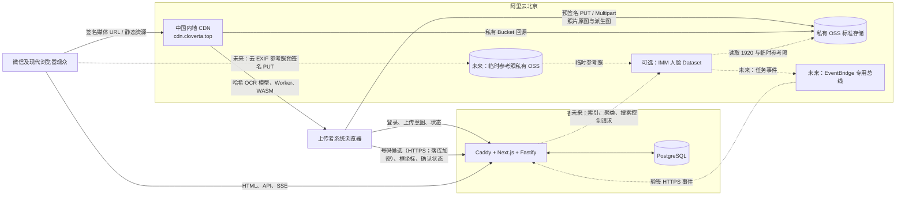
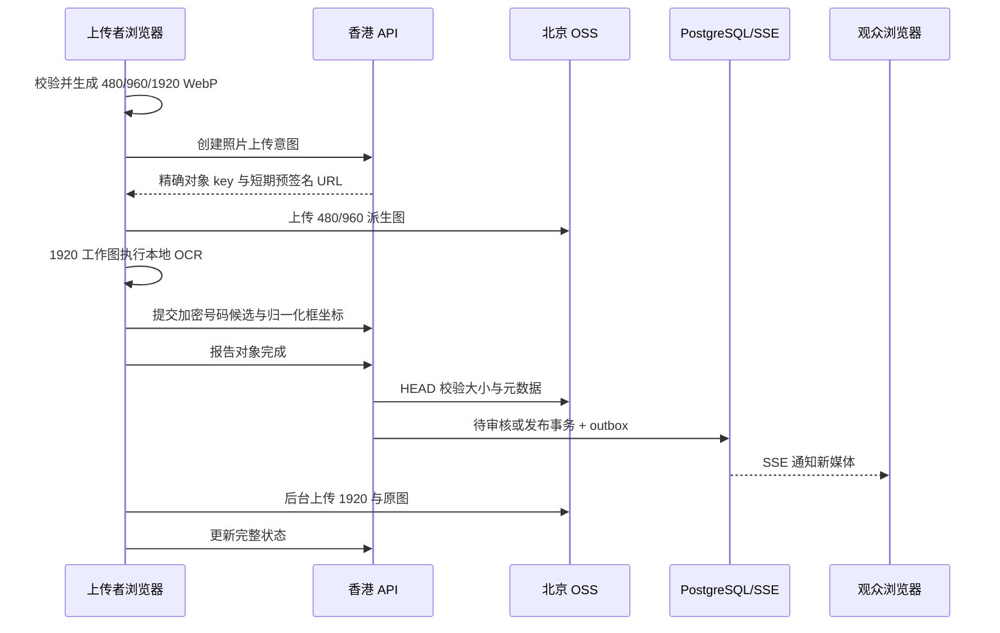
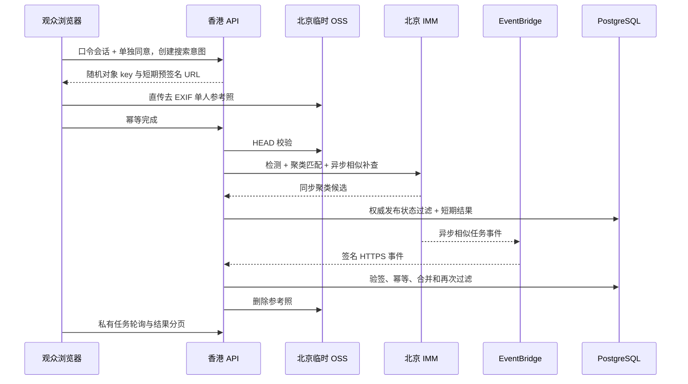

# 系统架构

状态：已批准的实施基线；人脸找图控制面已本地实现，云端链路未启用
更新日期：2026-09-02

## 1. 架构目标

架构围绕四个不可破坏的约束设计：

1. 照片二进制不经过香港业务服务器。
2. 基础照片与号码牌功能不增加 OSS/CDN 以外的阿里云产品；未来人脸找图只允许 ADR-012 列出的 IMM、EventBridge 和临时 OSS 增量边界。
3. 现有香港 2C2G 主机能够稳定运行首版控制面。
4. 将来更换 CDN 域名或迁移主站时，不需要改写数据库中的照片记录。

## 2. 部署拓扑

虚线为尚未实现、尚未开通的人脸找图边界。境内 4C4G 无备案主机不属于正式链路；EventBridge 直接向现有香港 HTTPS API 投递经签名事件。

## 3. 控制面与数据面

| 区域 | 保存/处理内容 | 禁止内容 |
| --- | --- | --- |
| 上传者设备 | 原始照片、本地照片派生、本地号码 OCR、上传临时状态 | 不保存云端长期密钥 |
| 观众设备（人脸找图启用时） | 当前参考照内存、去 EXIF JPEG、当前短期结果 | 人脸模型、整册人脸向量、持久参考照或结果 |
| 香港应用主机 | 账号、相册、分类、对象 key、宽高、大小、状态、加密号码标签/框坐标、年级/班级派生属性、无号码复核结论、未来人脸任务状态/短期媒体结果/最小同意回执、匿名统计、审计 | 照片/参考照正文、缩略图、BlurHash、GPS、原始文件名、号码明文、人脸向量、供应商额外人脸属性或长期相似度/聚类历史 |
| 北京媒体 OSS | 原图、WebP 派生图、静态构建/OCR 模型资源、加密数据库备份 | 公开读 ACL、号码 OCR 结果、人脸裁剪图或姓名标签 |
| 北京临时 OSS（未来） | 随机 key 的去 EXIF 单次参考照，最长 1 小时 | CDN 绑定、公开读、原文件名或长期保存 |
| 北京 IMM（另行授权后） | 每相册人脸 Dataset、检测/聚类/相似搜索元数据 | 跨相册搜索、姓名/学号/号码映射 |
| EventBridge（未来） | 指定 IMM 任务事件 | 参考照正文、通用审计转发、事件仓或长期业务分析 |
| 中国内地 CDN | OSS 静态对象缓存 | 动态 API、远程鉴权、实时日志 |

香港 API 返回的是 CDN 地址和照片几何信息。照片由观众浏览器直接向 CDN 请求。照片和封面使用 `next/image` 时必须设置 `unoptimized`、真实宽高/比例和响应式 `sizes`，最终 `src` 保持签名 CDN 地址；不得出现 `/_next/image` 请求或由 Next.js 拉取照片。Open Graph 元数据只引用 CDN 封面 URL，不主动抓取图片。

如果境外观众打开相册，照片会为交付给该观众而跨境传输；“照片不出境”只描述平台的存储、处理和面向中国内地用户的默认分发路径，不是对任何访问来源的绝对网络承诺。

## 4. 应用组成

### 4.1 Web

- Next.js 16 当前稳定小版本，React 19，Node.js 24 LTS。
- 服务器渲染相册首屏和分享元信息，后续交互走客户端请求。
- 同一个应用包含公开相册、内部工作台和上传 PWA。
- UI 基础遵循 [ADR-009](adr/009-lightweight-owned-ui-foundation.md)及其[ADR-010 修订](adr/010-base-ui-and-shadcn-governance.md)：语义 CSS Token、经目标 WebView 门禁确认的 Tailwind CSS、`base-nova` shadcn/ui 源码、Base UI 原语和 Lucide 图标。
- shadcn 配置和组件只属于 `apps/web`；`components.json` 位于该 workspace，生成原语进入 `apps/web/src/components/ui`，产品组合组件进入 `apps/web/src/components`。首版没有第二个 UI 消费者，不建立 `packages/ui`。
- 公共相册保持 Server Component 主体，分类、号码/人脸搜索、SSE 增量和灯箱分别作为最小 Client Island；工作台组件和 OCR 不得进入公共相册初始客户端图。人脸找图只在用户主动打开后加载文件处理 UI，不向观众下载人脸模型。
- Next.js Server Component 通过共享类型客户端调用 Fastify `/api/v1`，不直接连接 PostgreSQL；浏览器读写同样使用既定 REST/SSE。首版不使用 Server Action 建立第二套业务接口或绕过 Fastify 权限、错误和审计契约。
- Server Component 传给 Client Island 的属性只包含可序列化 JSON 表示；时间使用 ISO 8601 字符串，不传函数、类实例、`Map` 或 `Set`。浏览器专用照片/OCR 库只能从明确的 Client Component 动态导入。
- React Hook Form 复用共享 Zod schema；TanStack Virtual 只负责已加载长列表的渲染窗口，不替代服务端游标分页。
- 构建产物中的哈希静态资源发布至 OSS 的 `/assets/app/{releaseId}/`，经 CDN 公开长缓存。
- PaddleOCR.js、OpenCV.js、ONNX Runtime WASM 和固定 OCR 模型作为哈希静态资源自托管，只有启用识别的上传/审核页面懒加载。
- Service Worker 必须由主站同源提供，只缓存应用壳和上传任务元数据，不缓存受保护的相册 API 响应。
- Next.js Proxy 为每个文档请求生成 CSP nonce；脚本保持严格策略，照片读取和 OSS 直传分别只开放配置中的精确 CDN/上传 origin。nonce 要求页面动态渲染，不能用 `unsafe-inline` 换回静态输出。

### 4.2 API

- Fastify 5 提供 `/api/v1` REST、SSE、会话、上传签名和后台任务；未来还编排 IMM、参考照直传和 EventBridge 事件，仍不代理图片正文。
- Zod 定义输入输出和 OpenAPI；Web 与 API 共享同一契约包。
- API 是无状态 HTTP 服务，持久状态全部进入 PostgreSQL。
- 上传签名在服务器本地计算，客户端不获得 OSS AccessKey。

### 4.3 PostgreSQL

- PostgreSQL 18 当前稳定小版本，数据库运行于香港主机本地 Docker 卷。
- Drizzle 维护显式 SQL 迁移。
- 事件 outbox、定时任务和 SSE 重放均使用 PostgreSQL，不引入 Redis。未来人脸索引、短期搜索和删除任务同样使用持久 PostgreSQL 状态；EventBridge 只传递供应商完成事件，不替代业务状态存储。
- 每日执行加密逻辑备份，备份进入北京 OSS 的独立私有前缀。

### 4.4 反向代理

- Caddy 终止主站 HTTPS，将页面请求转发给 Next.js，将 `/api/*` 和 SSE 转发给 Fastify。
- SSE 路径关闭代理缓冲，设置长连接超时和心跳透传。
- 生产访问日志不得记录原始 IP、查询串中的临时媒体签名或 Cookie。

## 5. 核心数据流

### 5.1 照片上传与发布

号码 OCR 与发布状态独立。OCR 失败或尚未确认时照片仍按原流程发布；确认后写入加密标签、exact-search blind index，并按映射版本自动派生年级/班级。OCR 无候选不会自动写成无号码；人工“无号码”是独立、可撤销的照片级结论。所有号码/属性变化只发出不含号码值的通用更新事件。详细流程见[号码牌识别与筛选](12-bib-recognition.md)。

### 5.2 人脸候选找图（默认关闭）

媒体发布与人脸索引解耦。只有已发布且 1920 完整的照片进入每相册独立 Dataset；一批索引完成后按静默窗口增量聚类。参考照和搜索结果短期保存，人脸向量不进入 PhotoStream。详细流程见[人脸候选找图](14-face-search.md)。

### 5.3 实时更新

- 每次发布、隐藏或媒体完整度变化都在同一数据库事务写入 `live_event`。
- API 通过 PostgreSQL `NOTIFY` 唤醒当前实例中的 SSE 订阅者。
- SSE 事件携带单调游标；断线重连时通过 `Last-Event-ID` 查询并补发数据库事件。
- 微信切后台或网络代理阻断 SSE 时，客户端每 15 秒轮询增量接口；连续稳定后恢复 SSE。
- 已结束相册停止实时连接，改为普通分页浏览。

## 6. 扩展与容量策略

首版不为大型活动提前引入分布式系统，但保留以下扩展接缝：

- API 不依赖本地内存状态，可以增加第二实例；届时仍可通过 PostgreSQL outbox 协调。
- 数据库只保存对象 key，不保存完整 CDN URL，可以替换域名或 CDN 服务。
- 游标分页和发布序号不会因单场照片量增长而退化成大 OFFSET 查询。
- 静态资源和照片均由 CDN 承担，香港主机的带宽只服务 HTML、JSON 和 SSE 小消息。
- 未来人脸结果只保存短期媒体 ID；供应商原始响应和人脸向量不成为香港数据库的长期扩展面。
- 照片模型不保留其他文件类型的枚举或扩展占位；产品边界变化必须先由新的 Accepted ADR 明确批准。

超过以下任一条件时才重新评估 Redis、托管数据库或多实例：500 条持续 SSE 连接、API CPU 持续超过 70%、PostgreSQL 连接持续超过安全池上限，或需要跨主机高可用。

## 7. 主要故障与降级

| 故障 | 用户表现 | 既定恢复方式 |
| --- | --- | --- |
| 香港 API 暂停 | 无法登录/获取新列表，已获得的 CDN 媒体仍可加载 | Caddy 健康检查、容器重启；SSE 重连后按游标补发 |
| PostgreSQL 暂停 | 动态操作停止 | 禁止写入，恢复数据库；不以本地内存接单 |
| OSS 上传失败 | 单文件或分片失败 | 保留完成对象/分片，指数退避并允许重新签名 |
| CDN 缓存未命中 | 首次照片加载稍慢 | 私有 OSS 普通回源，随后长缓存 |
| SSE 被微信挂起 | 新媒体提示延迟 | 15 秒增量轮询 |
| 本地图片编码失败 | 当前文件失败 | 退化 JPEG 派生图；仍失败则拒绝并说明 |
| 本地号码 OCR 不支持/失败 | 无自动候选 | 照片照常上传发布，改为手工补录 |
| OCR 没有候选 | 照片仍待号码复核 | 人工选择“无号码”或手工添加，不自动创建任何标签/属性 |
| 号码规则变更 | 旧标签可能不再有效 | 只重校验标签元数据；无效标签移出公共索引并进入复核 |
| 年级/班级映射变更 | 属性筛选暂不可用 | 从确认号码持久重算，不读取图片；完成后恢复属性筛选 |
| IMM 索引/聚类延迟 | 最近照片暂时搜不到 | 普通相册继续可用；展示索引进行中并由持久任务重试 |
| EventBridge 事件延迟/重复 | 异步补查稍后到达或重复 | 同步聚类结果可先显示；按事件/任务 ID 幂等合并 |
| 参考照无人脸/多脸/低质量 | 当前搜索无法开始 | 立即删除参考照并提示换一张清晰单人照 |
| 人脸索引删除部分失败 | 已停止搜索但云端清理未完成 | 本地门禁阻止返回，持久重试并显示删除处理中 |
| 朋友无法维护 DNS | 新证书/CNAME 变更受阻 | 通过可配置媒体域名迁移，不修改数据库对象 key |

## 8. 架构禁止项

- 不允许业务服务器代理上传或下载照片。
- 不允许把 OSS Bucket 改成公共读。
- 不允许使用 Next.js 图片优化接口访问照片。
- 不允许在香港生成缩略图、BlurHash 或执行照片格式转换。
- 不允许在香港或第三方服务运行号码 OCR、保存号码明文日志或执行号码到姓名映射。
- 不允许用客户端持有的长期 AccessKey 代替预签名上传。
- 除 ADR-012 明确限定的北京 IMM 人脸处理和 EventBridge 官方任务事件外，不允许云端视觉/OCR、消息队列、事件仓、函数计算或第三方分析服务；号码 OCR 仍不得离开上传设备。
- 不允许把 IMM 的年龄、性别、情绪、吸引力等额外属性写入应用、日志、数据库、备份或 UI。
- 不允许把人脸向量或整册人脸索引下发到观众浏览器，也不允许通过香港代理参考照或相册照片。
- 不允许在没有新 ADR 的情况下加入 Redis、MNS、RocketMQ、RDS、函数计算或其他云端媒体处理。
