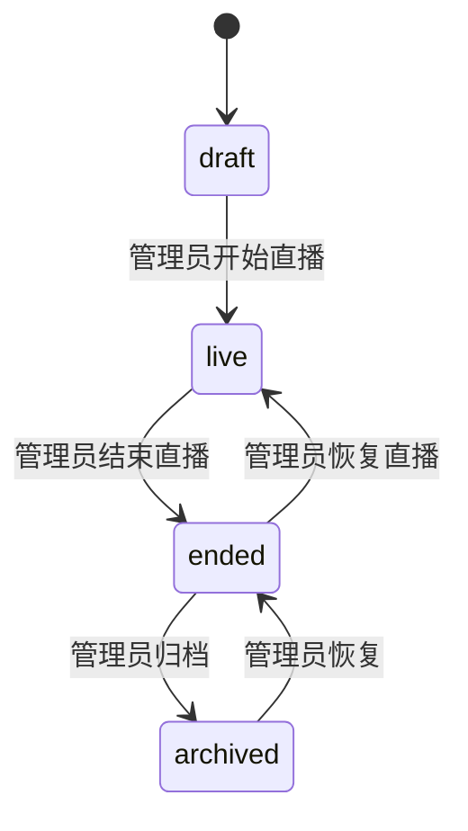
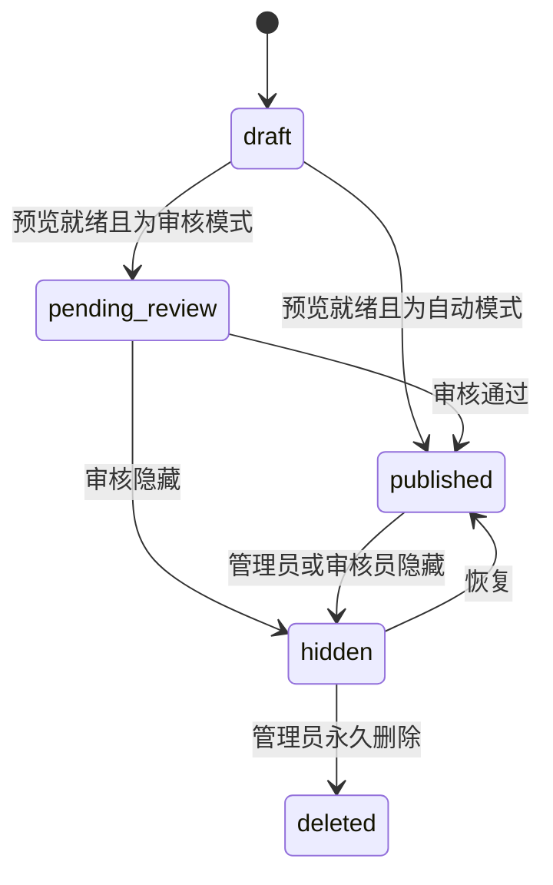

# 领域模型与 API 设计

状态：已批准的实施基线；人脸找图契约与 API 已本地实现，云端未启用
更新日期：2026-08-31

## 1. 设计原则

- 对外接口统一位于同源 `/api/v1`，使用 JSON；实时事件使用 SSE。
- 领域状态与上传传输状态分离，避免“已上传”等同于“已发布”。
- 所有写操作可重试并具备幂等键；对象不可覆盖。
- 公共列表使用游标分页，不使用页码加大 OFFSET。
- API 只暴露 CDN 临时地址，不暴露 OSS Endpoint、Bucket 名或 AccessKey。
- 数据库只保存对象 key；媒体域名、鉴权方式和签名密钥属于运行配置。

## 2. 核心枚举

| 名称 | 取值 | 说明 |
| --- | --- | --- |
| `UserRole` | `admin`、`reviewer`、`uploader` | 内部角色 |
| `AlbumState` | `draft`、`live`、`ended`、`archived` | 相册生命周期 |
| `AlbumAccess` | `password`、`public` | 观众访问方式 |
| `PublishMode` | `review`、`auto` | 媒体准备完成后的处理方式 |
| `IngestStatus` | `created`、`local_processing`、`uploading_preview`、`preview_ready`、`uploading_source`、`ready`、`failed`、`cancelled` | 采集/上传完整度 |
| `PublicationStatus` | `draft`、`pending_review`、`published`、`hidden`、`deleted` | 观众可见性 |
| `VariantKind` | `photo_480`、`photo_960`、`photo_1920`、`photo_original` | OSS 对象角色 |
| `BibTagStatus` | `suggested`、`confirmed`、`rejected`、`needs_review` | 号码候选/索引状态 |
| `BibTagSource` | `ocr`、`manual` | 号码来源 |
| `BibReviewDecision` | `pending`、`numbers_confirmed`、`no_number_confirmed`、`needs_review` | 照片级号码复核结论 |
| `BibAttributeDimension` | `grade`、`class` | 号码派生属性维度 |
| `FaceIndexState` | `disabled`、`provisioning`、`indexing`、`ready`、`degraded`、`deleting`、`failed` | 相册人脸 Dataset 生命周期 |
| `FaceMediaIndexStatus` | `pending`、`indexing`、`indexed`、`deleting`、`excluded`、`failed` | 逐媒体人脸索引状态 |
| `FaceSearchStatus` | `awaiting_upload`、`processing`、`partial`、`completed`、`failed`、`cancelled`、`expired` | 未来访客私有搜索状态 |

`IngestStatus` 与 `PublicationStatus` 必须独立保存。例如一张照片可以处于 `uploading_source + published`，表示浏览图已直播、原图仍在后台上传。

前端展示状态同样不得引入覆盖真实领域状态的单一“总状态”。上传/审核卡片并列映射 `IngestStatus`、`PublicationStatus`、多条 `BibTagStatus` 和照片级 `BibReviewDecision`；显示文案与组合规则见[前端与交互设计](06-frontend-ux.md)。该映射是 UI 表示，不新增 REST/SSE 枚举，也不改变数据库状态机。

## 3. 核心实体

### 3.1 User 与 Session

`User` 保存随机 ID、用户名、展示名、角色、密码摘要、启用状态、首次改密标记、创建/更新时间。用户名在规范化后唯一。

`Session` 保存随机会话 ID 摘要、用户 ID、创建时间、最近使用时间、绝对过期时间和吊销时间。只在 Cookie 中保存原始随机令牌。

### 3.2 Album

`Album` 保存：

- 随机 ID 与不可枚举的公开 slug；
- 标题、说明、封面媒体 ID、活动起止时间；
- `AlbumState`、`AlbumAccess`、`PublishMode`；
- 口令摘要与 `accessVersion`；
- 普通图、原图两个独立下载开关；
- 号码识别/观众搜索开关、当前规则/映射版本和 OCR 模型版本；
- 未来人脸找图开关、告知版本、授权确认时间、`FaceIndexState`、IMM Dataset 随机标识、索引删除期限和最后通用错误码；
- 品牌展示名称、Logo 对象 key、强调色；
- 创建者、创建/更新时间和发布序列计数器。

相册口令修改或访问方式变化时递增 `accessVersion`，旧访客会话失效。

### 3.3 Category

一级分类只保存相册 ID、名称、排序和启用状态。首版禁止嵌套。删除有媒体的分类时必须先迁移媒体或将其归入“未分类”。

### 3.4 Media

`Media` 是照片记录，保存：

- ID、相册 ID、分类 ID；
- 上传者 ID、`IngestStatus`、`PublicationStatus`；
- 宽、高、MIME 类型、总字节数；
- 客户端提取的拍摄时间和服务端接收时间；
- 单调 `publishSequence`、发布时间、隐藏时间；
- 失败代码、可重试标记、创建/更新时间。

不保存原始文件名、GPS、缩略图正文或可还原图像的占位数据。UI 下载文件名使用相册标题、发布序号和安全扩展名生成。

### 3.5 MediaVariant

每个媒体对象的变体单独保存：类型、OSS object key、格式、宽、高、字节数、ETag、完成时间和校验状态。`media_id + variant_kind` 唯一，完成后 object key 不可修改。

### 3.6 UploadIntent 与 UploadPart

`UploadIntent` 保存媒体 ID、幂等键、预期变体、原始声明大小、过期时间和总体状态。

`UploadPart` 仅用于分片对象，保存 upload ID、part number、预期范围、ETag 和完成状态。过期任务由后台作业终止 OSS multipart 并清理数据库记录。

### 3.7 LiveEvent

`LiveEvent` 保存单调 ID、相册 ID、事件类型、媒体 ID、最小载荷、创建时间。事件载荷不直接保存临时 CDN URL，重放时重新签名。

### 3.8 AuditLog 与统计

`AuditLog` 保存操作者、动作、目标类型/ID、结果、变更字段摘要和时间，不保存密码、口令、签名 URL 或原始 IP。

匿名统计按相册和日期聚合页面打开、匿名会话与下载链接签发。匿名访客 ID 使用第一方随机 Cookie；服务端仅保存每日轮换盐下的摘要，30 天后删除明细，只保留聚合计数。

### 3.9 号码规则与标签

`BibPattern` 保存相册、规则版本、总位数、排序和启用状态；`BibConstraint` 保存起始位、宽度和排序；`BibAllowedRange` 保存固定宽度的起止字符串。模式之间为 OR、约束之间为 AND，未约束位置匹配任意数字。

`BibAttributeOption` 保存 `grade`/`class`、不可变 ID、显示名和排序；`BibAttributeMapping` 保存维度、位置、宽度、允许区间、输出选项和映射版本。相同号码同一维度不得确定性地映射到不同输出。

`MediaBibTag` 保存相册/媒体、号码密文、相册作用域 blind index、`BibTagStatus`、`BibTagSource`、置信度、0–1 归一化四边形、规则/模型版本、派生 `gradeOptionId`/`classOptionId`、映射版本、创建与确认审计。数据库不保存号码明文，审计日志也不保存号码值。

`MediaBibReview` 保存照片、`BibReviewDecision`、决定人/时间和最后变更原因。OCR 无候选、OCR 失败或拒绝全部候选都不能自动写成 `no_number_confirmed`。

一张照片可拥有多个确认号码；`album_id + media_id + blind_index + confirmed` 必须避免重复搜索标签。只有 `confirmed` 且规则版本有效的标签进入公共精确搜索。年级+班级筛选必须在同一 `MediaBibTag` 上同时匹配，不能跨两个号码组合属性。

### 3.10 人脸索引与短期搜索

`AlbumFaceIndex` 保存相册、功能开关、告知版本、授权核验时间、`FaceIndexState`、随机 IMM Dataset 标识、阈值版本、最近索引/聚类时间、删除期限和通用失败码。Dataset 标识不能从相册标题、slug 或学校信息推导。

`MediaFaceIndexTask` 保存相册/媒体、`FaceMediaIndexStatus`、供应商任务关联、重试、下一次尝试时间和删除确认时间；不保存人脸框、向量、聚类、相似度或额外属性。`excluded` 是管理员明确退出索引的持久门禁，媒体恢复/重新发布不能自动覆盖。

`FaceSearchIntent` 保存随机 ID、相册、访客会话摘要、`FaceSearchStatus`、随机临时对象 key、同意告知版本/声明类型、供应商任务关联、结果/参考照到期时间和通用失败码。短期候选单独保存媒体 ID 与过期时间；不保存供应商 URI、聚类 ID或相似度。

`FaceIntegrationEvent` 只保存 EventBridge 事件 ID、已知任务 ID、处理结果和时间，用于幂等与审计；原始 payload 不落库。详细合同见[人脸候选找图](14-face-search.md)。

## 4. 状态转换

### 4.1 相册

草稿相册不能被普通观众访问。归档只改变管理界面和实时连接行为，不删除 OSS 对象。

### 4.2 媒体发布

永久删除是单独的确认流程；数据库先进入删除任务，OSS 删除和 CDN 刷新成功后才完成最终状态。

## 5. 身份与权限接口

| 方法与路径 | 调用者 | 行为 |
| --- | --- | --- |
| `POST /api/v1/auth/login` | 未登录 | 建立后台会话，受严格限流 |
| `POST /api/v1/auth/change-password` | 已登录 | 首次登录或主动修改密码 |
| `POST /api/v1/auth/logout` | 已登录 | 吊销当前会话 |
| `GET /api/v1/auth/session` | 已登录 | 返回当前用户与权限 |
| `GET/POST/PATCH /api/v1/users` | 管理员 | 成员查询、创建、角色和启用状态管理 |
| `POST /api/v1/users/{id}/reset-password` | 管理员 | 生成一次性临时密码并吊销旧会话 |

所有浏览器写请求必须通过同源 Cookie、CSRF 令牌和 Origin 校验。

## 6. 相册与媒体接口

| 方法与路径 | 权限 | 行为 |
| --- | --- | --- |
| `GET/POST /api/v1/albums` | 内部；创建仅管理员 | 查询或创建相册 |
| `GET/PATCH /api/v1/albums/{id}` | 内部；修改按角色 | 读取或修改配置 |
| `POST /api/v1/albums/{id}/start` | 管理员 | 草稿进入直播 |
| `POST /api/v1/albums/{id}/end` | 管理员 | 结束直播 |
| `GET/POST/PATCH /api/v1/albums/{id}/categories` | 内部；写需管理员/审核员 | 一级分类管理 |
| `GET/PUT /api/v1/albums/{id}/bib-config` | 内部；写仅管理员 | 号码规则、年级/班级映射、识别/搜索开关和模型状态 |
| `GET/PUT /api/v1/albums/{id}/face-config` | 管理员 | 人脸开关、授权确认、告知版本、索引/保留状态 |
| `POST /api/v1/albums/{id}/face-index/retry` | 管理员 | 重试人脸索引/删除失败任务 |
| `POST /api/v1/albums/{id}/face-index/exclusions` | 管理员 | 让选定照片退出人脸索引但保留普通浏览 |
| `DELETE /api/v1/albums/{id}/face-index` | 管理员 | 关闭人脸搜索并建立整册 Dataset 删除任务 |
| `GET /api/v1/albums/{id}/media` | 内部 | 按状态、分类、上传者游标查询 |
| `POST /api/v1/media/{id}/publish` | 管理员/审核员 | 幂等发布并分配发布序号 |
| `POST /api/v1/media/{id}/hide` | 管理员/审核员 | 从公共流隐藏 |
| `DELETE /api/v1/media/{id}` | 管理员 | 建立永久删除任务 |
| `POST /api/v1/media/batch` | 管理员/审核员 | 批量发布、隐藏或改分类 |

批量操作必须返回每个媒体的结果，不能因单个失败回滚其他已明确可执行的项目；请求整体使用幂等键防止重复提交。

## 7. 号码牌接口

| 方法与路径 | 权限 | 行为 |
| --- | --- | --- |
| `POST /api/v1/albums/{id}/bib-config/test` | 管理员 | 测试号码并返回逐规则、年级和班级派生结果 |
| `POST /api/v1/media/{id}/bib-candidates` | 该照片上传者/管理员/审核员 | 幂等提交最多 8 个本地 OCR 候选 |
| `POST /api/v1/media/{id}/bib-tags` | 该照片上传者/管理员/审核员 | 手工添加符合当前规则的确认号码 |
| `POST /api/v1/media/{id}/bib-tags/{tagId}/confirm` | 有权限内部人员 | 确认或修正候选 |
| `POST /api/v1/media/{id}/bib-tags/{tagId}/reject` | 有权限内部人员 | 拒绝候选 |
| `DELETE /api/v1/media/{id}/bib-tags/{tagId}` | 有权限内部人员 | 删除标签 |
| `POST /api/v1/media/bib-tags/batch` | 管理员/审核员 | 给选中照片添加同一确认号码 |
| `POST /api/v1/media/{id}/bib-review/no-number` | 该照片上传者/管理员/审核员 | 明确确认照片无号码并拒绝剩余候选 |
| `POST /api/v1/media/{id}/bib-review/reset` | 有权限内部人员 | 撤销照片级结论，恢复待复核 |
| `POST /api/v1/media/bib-review/no-number/batch` | 管理员/审核员 | 批量确认选中照片无号码 |

候选接口只接收数字字符串、置信度、归一化四边形和模型/规则版本，不接收裁剪图、原图或可还原图像的数据。服务端重新执行规则校验，并在写库前加密号码、计算 blind index。

确认或修正号码时在同一事务中派生年级/班级并更新照片级结论。确认无号码只允许没有确认标签的照片；迟到 OCR 候选不能覆盖人工无号码结论；添加号码会自动清除无号码结论；删除最后一个确认号码恢复 `pending`。

修改合法性规则递增版本并建立持久重校验任务：仍合法标签升级版本；不合法确认标签进入 `needs_review` 并从公共索引移除。修改属性映射递增 `mappingVersion`，从已确认号码重算年级/班级，不读取 OSS 图片，也不自动重新 OCR。

详细契约见[号码牌识别与筛选](12-bib-recognition.md)。

## 8. 人脸找图接口

| 方法与路径 | 调用者 | 行为 |
| --- | --- | --- |
| `POST /api/v1/public/albums/{slug}/face-searches` | 已解锁观众 | 校验功能/限流/同意，创建私有意图并返回精确临时 OSS PUT |
| `POST /api/v1/public/albums/{slug}/face-searches/{id}/complete` | 意图创建会话 | HEAD 验证参考照并幂等启动同步/异步搜索 |
| `GET /api/v1/public/albums/{slug}/face-searches/{id}` | 意图创建会话 | 返回私有状态、短期媒体结果和结果游标 |
| `DELETE /api/v1/public/albums/{slug}/face-searches/{id}` | 意图创建会话 | 取消展示并尽快清理参考照/短期结果 |
| `POST /api/v1/integrations/aliyun/eventbridge` | EventBridge | 验签并幂等接收指定 IMM 任务事件 |

创建意图只允许 `password + faceSearchEnabled + ready/degraded` 的相册，必须携带当前告知版本、`self` 或 `guardian_or_authorized` 声明，未知字段严格拒绝。每访客会话和每日轮换 IP-HMAC 每 10 分钟最多 3 次、每天最多 10 次。

参考照只允许静态 JPEG/PNG/WebP 输入，浏览器必须先转为去 EXIF JPEG；最终对象不超过 3 MiB、最长边不超过 1920。临时 object key 由服务端分配且禁止覆盖。完成接口只 HEAD，不经香港下载图片。

EventBridge 入口不接受 Cookie，必须验证 RSA 签名、官方证书 URL、60 秒时间窗、账号、杭州地域、IMM Project/Dataset、事件类型、已知 TaskId、body 上限和事件 ID 幂等。原始事件、供应商 URI、聚类、相似度和额外属性不得写日志或数据库。

同步聚类与异步补查只生成候选；每次响应前重新过滤当前相册、`published`、未排除/未删除媒体。结果按发布序号倒序，不返回分数，不通过 SSE 广播。无匹配与被权威状态全部过滤使用相同空结果。

## 9. 上传接口

| 方法与路径 | 行为 |
| --- | --- |
| `POST /api/v1/uploads` | 创建照片上传意图，返回媒体 ID、对象 key 和允许的步骤 |
| `POST /api/v1/uploads/{id}/objects/{variant}/sign` | 为单个精确 object key 生成短期 V4 PUT URL |
| `POST /api/v1/uploads/{id}/multipart/{variant}/start` | 初始化分片任务并返回 upload ID、part 大小 |
| `POST /api/v1/uploads/{id}/multipart/{variant}/parts/sign` | 批量签发指定 part number 的 URL |
| `POST /api/v1/uploads/{id}/multipart/{variant}/complete` | 校验 part 列表、完成 OSS 合并并 HEAD 验证 |
| `POST /api/v1/uploads/{id}/objects/{variant}/complete` | HEAD 验证普通 PUT 并更新媒体状态 |
| `POST /api/v1/uploads/{id}/cancel` | 终止未完成上传并取消媒体 |
| `GET /api/v1/uploads/{id}` | 恢复上传队列所需的权威服务端状态 |

签名接口只允许服务端预先分配的 object key、大小、Content-Type 和必要请求头。预签名默认 15 分钟有效；客户端不得自行指定 Bucket、前缀或最终 object key。

客户端调用完成接口时必须携带幂等键。API 使用 HEAD 校验对象存在、大小和 Content-Type；不下载媒体正文。

## 10. 观众接口

| 方法与路径 | 行为 |
| --- | --- |
| `GET /api/v1/public/albums/{slug}` | 返回相册公开信息或口令要求，不泄露媒体 |
| `POST /api/v1/public/albums/{slug}/unlock` | 校验口令并建立受限访客会话 |
| `GET /api/v1/public/albums/{slug}/media` | 按分类、游标和上限返回已发布媒体及短期 CDN URL |
| `GET /api/v1/public/albums/{slug}/events` | SSE 增量事件；支持 `Last-Event-ID` |
| `GET /api/v1/public/albums/{slug}/changes` | SSE 不可用时的游标增量查询 |
| `POST /api/v1/public/albums/{slug}/bib-search` | 口令相册精确查询已确认号码对应的已发布照片 |
| `POST /api/v1/public/albums/{slug}/bib-attributes-filter` | 按年级或年级+班级筛选同一确认号码标签对应的已发布照片 |
| `POST/GET/DELETE /api/v1/public/albums/{slug}/face-searches...` | 未来同意门禁的人脸候选搜索；私有任务与结果，不进入相册 SSE |
| `POST /api/v1/public/albums/{slug}/downloads/{mediaId}/{kind}` | 校验相册开关、记录签发并返回 5 分钟 CDN 地址 |
| `POST /api/v1/public/albums/{slug}/analytics/open` | 记录匿名打开，不接收原始 IP/UA 字段 |

公开媒体列表每次最多返回 60 条；首屏服务器渲染 30 条。游标由最后一条 `publishSequence` 和 ID 组成并签名，客户端不得篡改排序位置。

号码搜索值只出现在 HTTPS POST 正文和请求处理内存中，不进入 URL、访问日志、统计或 SSE。无匹配、只有未发布匹配与不存在号码返回同一空结果，不提供相近号码、自动补全或号码目录。

属性筛选要求 `gradeOptionId`，`classOptionId` 可选；提供班级时必须在同一确认标签上同时匹配该年级。无号码、待复核、属性缺失和旧映射版本照片不进入属性结果，但仍保留在普通相册流。公共配置可以返回年级/班级选项名称和排序，不返回号码规则范围、匹配数量或名单。

## 11. SSE 契约

每个事件包含：事件 ID、事件类型、相册 ID、媒体 ID、服务端时间和最小变更摘要。临时 CDN URL 不写入 outbox；客户端收到事件后通过增量接口取回当前媒体表示。

号码确认、删除或失效使用通用 `media.bib.updated` 事件，载荷不得包含号码、blind index、置信度或框坐标。

人脸索引可用性变化只允许使用不含任务、聚类、人物或结果的通用相册配置更新；个人参考照状态和结果永远不进入 SSE/outbox，由创建会话私有轮询。

心跳每 20 秒发送一次。客户端最多立即重连 3 次，此后使用指数退避；微信切后台返回前台时先请求增量，再恢复 SSE。

## 12. 错误与幂等

所有错误返回稳定机器码、中文用户消息、请求 ID 和可重试标志。不得向客户端返回 SQL、OSS Endpoint、Bucket、堆栈、密钥或签名计算细节。

关键错误码至少包括：认证失败、角色不足、相册已结束、口令错误/限流、格式不支持、媒体超限、本地处理不支持、号码规则/属性映射无效、号码不匹配规则、属性映射冲突、OCR 候选过多/版本过期、已有号码不能确认无号码、号码/属性搜索禁用或限流、未来人脸搜索关闭/索引未就绪/参考照无脸/多脸/质量不足/处理中/供应商不可用/清理失败、签名过期、对象校验失败、分片不完整、状态冲突和删除任务失败。

创建上传、完成上传、发布、隐藏、批量操作、下载签发、人脸搜索完成和 EventBridge 事件都接受或拥有可验证幂等标识。相同主体、路径和幂等键在有效期内必须返回同一业务结果。

## 13. 删除语义

- “隐藏”只从相册列表移除，不删除 OSS 对象；已签发 URL 可能在短期有效期内继续访问。
- “取消上传”写入持久清理状态，终止未完成 multipart，并删除未发布对象；失败按退避重试。若 480/960 已发布或待审核，则保留已验证预览，只清理未完成的后续对象。
- “永久删除”删除全部变体、提交 CDN 刷新并保留不含媒体地址的审计记录；未来启用人脸功能时还必须删除对应 IMM 文件元数据。
- 永久删除照片时同步删除全部号码密文、blind index、派生属性、复核结论和候选框；相册结束 30 天后清理未确认/已拒绝号码候选，并删除整册 IMM Dataset。
- 人脸参考照正常完成即删除，异常最长 1 小时、1 天生命周期兜底；短期结果最长 2 小时。相册改公开、关闭功能或授权范围失效时先阻止新搜索，再持久分页清空 IMM 文件元数据、删除 Dataset 并读回确认。
- 管理员可让照片退出人脸索引而不删除普通照片；无法证明投诉/撤回范围完整时删除整册 Dataset，不能用只隐藏结果冒充云端删除。
- 删除任务失败必须可重试，不能在部分失败时谎报成功。
